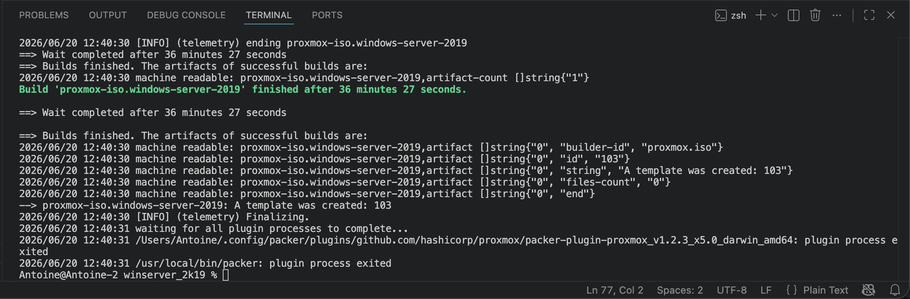
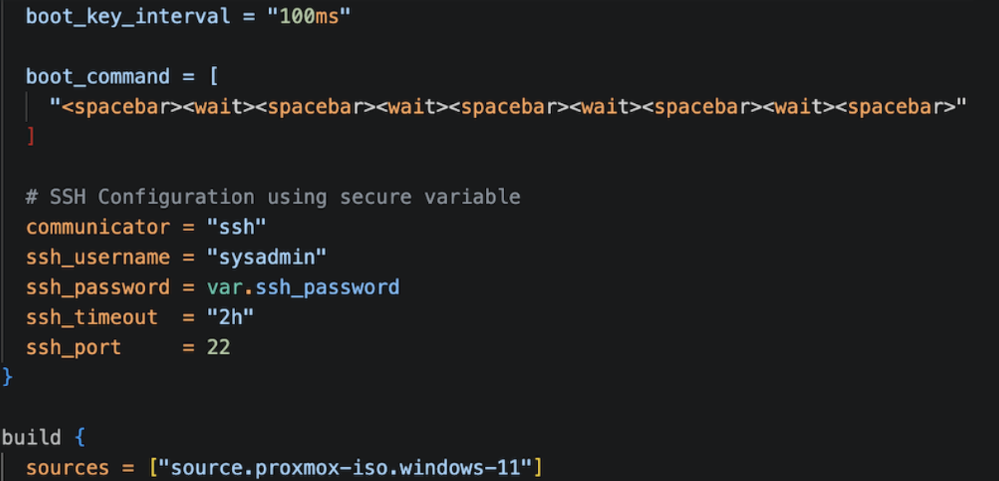
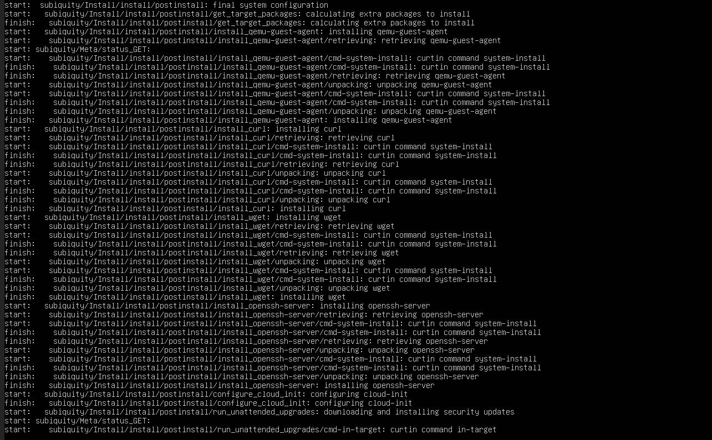
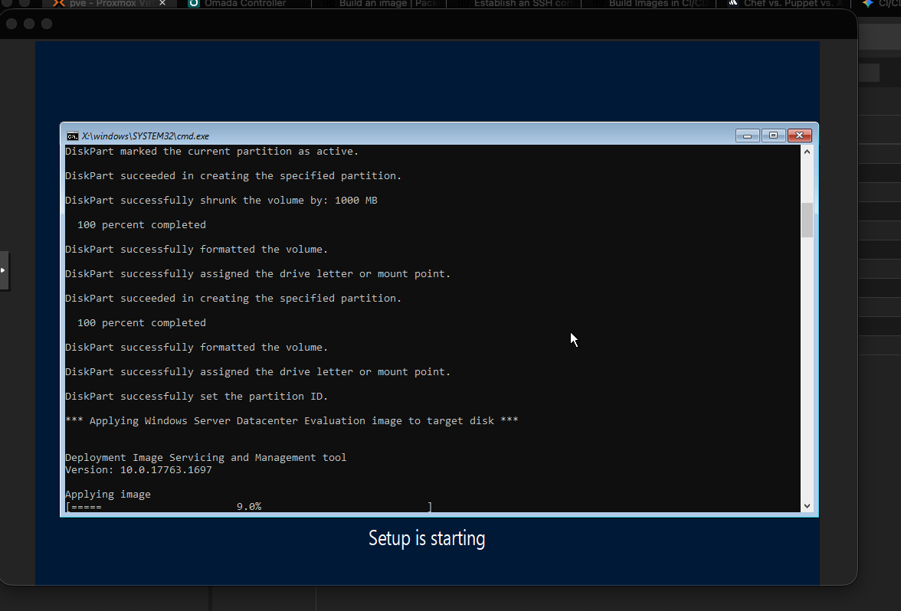
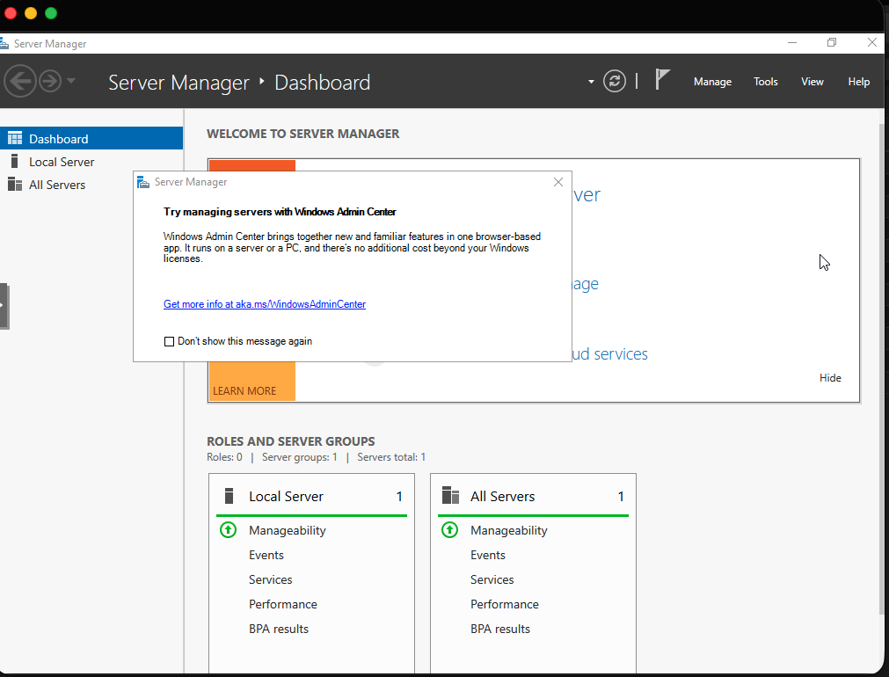

# Packer: Automated Golden Image Provisioning

This repository contains the Packer build configurations and automated answer files used to generate the baseline machine images for my infrastructure environment. 

Packer perfectly complements orchestration workflows. I adopted it when using Terraform; I acknowledged the limits with it being an infrastructure provisioning tool. Without a pre-configured image, the machines will be installed from whatever ISO file I used and be completely independent machines in terms of software installed, SSH running, QEMU agent installed and enabled for Proxmox hosted machines, etc.

## Key Engineering Benefits & Proficiencies
This project bridges the gap between orchestration and immutable server deployment. By integrating these disciplines, this repository demonstrates several core NetDevOps methodologies:

* **Immutable Infrastructure (Packer & State Management):** Enforces a defined, reproducible state for machine images. This eliminates configuration drift and ensures idempotency across every deployment.
* **Zero-Touch Provisioning (Unattended OS Configuration):** Leverages `preseed.cfg`, `autounattend.xml`, and `cloud-init` to entirely remove manual intervention from the deployment pipeline.
* **Scalable Deployments (Virtualization & API Integration):** Integrates directly with the Proxmox VE API for bare-metal automated builds, utilizing a declarative HCL baseline that can easily scale across AWS, Azure, GCP, and Hyper-V.
* **CI/CD Methodology:** Enables a true "disposable infrastructure" model. Machine environments can be destroyed and recreated within a single automated pipeline run, reflecting enterprise-grade configuration management.
* **Vast Documentation & Official Guide:** Supported by comprehensive documentation, practical examples, and the official guide available directly via the [HashiCorp Packer Documentation](https://developer.hashicorp.com/packer/docs).

## Repository Structure
Configurations are separated by operating system to maintain a clean, modular image factory. Unattended installation files (`preseed.cfg`, `autounattend.xml`, `cloud-init`) are nested within their respective builds to ensure agnostic deployments.

```text
.
├── kali/
│   ├── kali.pkr.hcl
│   └── http/
│       └── preseed.cfg
├── ubuntu_desktop/
│   ├── ubuntu-desktop.pkr.hcl
│   └── http/
│       ├── meta-data
│       └── user-data
├── ubuntu_server/
│   ├── ubuntu-server.pkr.hcl
│   └── http/
│       ├── meta-data
│       └── user-data
├── win11/
│   ├── win11.pkr.hcl
│   └── autounattend.xml
└── winserver_2k19/
    ├── winserver-2k19.pkr.hcl
    └── autounattend.xml
```

## Usage and Execution

### 1. Initialize Packer
Initialize the working directory to download and install the necessary plugins (such as the Proxmox builder plugin):
```bash
packer init .
```

### 2. Validate the Configuration
Run a validation check against your template files to ensure there are no syntax errors or invalid configurations before starting a build:
```bash
packer validate .
```

### 3. Run the Build
Execute the build pipeline using your configurations:
```bash
packer build .
```



## Tips, Tricks & Variable Management

To keep these templates agnostic and secure, never hardcode sensitive environment details directly into the `pkr.hcl` files.

### 1. Secrets Management
You must pass your specific environment details to Packer using a `.pkrvars.hcl` file. Ensure your `.gitignore` is actively blocking any `.env` or `.pkrvars.hcl` files from being pushed to version control.

**Example `secrets.pkrvars.hcl`:**
```hcl
proxmox_api_url   = "[https://10.0.0.](https://10.0.0.)X:8006/api2/json"
proxmox_api_id    = "packer@pve!automation"
proxmox_api_token = "your-secret-token-here"
proxmox_node      = "pve-01"
```



Run the build by appending the variable flag:
```bash
packer build -var-file="../secrets.pkrvars.hcl" .
```

### 2. Debugging Silent Failures
If a build hangs during the hypervisor boot sequence or the unattended answer file stalls without throwing an error back to your terminal, you need raw output. Enable verbose logging by appending `PACKER_LOG=1` to your build execution:
```bash
PACKER_LOG=1 packer build .
```

### 3. Code Formatting
Maintain a clean and standardized repository. Before committing any pipeline changes, format your HCL code to HashiCorp's official standard:
```bash
packer fmt .
```
## The Zero-Touch Process in Action
Visualizing the unattended configuration process via the Proxmox console:







## Lessons Learned

* **Use Trusted Public Answer File Generators and Official Sites for Assistance Constructing Answer files:**
    * **Windows:** [Schneegans Windows Unattend Generator](https://schneegans.de/windows/unattend-generator/) and the [Official Microsoft Sysprep Docs](https://learn.microsoft.com/en-us/windows-hardware/manufacture/desktop/update-windows-settings-and-scripts-create-your-own-answer-file-sxs).
    * **Ubuntu:** [Ubuntu Autoinstall Configuration Manual](https://canonical-subiquity.readthedocs-hosted.com/en/latest/reference/autoinstall-reference.html) for exact Subiquity syntax.
    * **Debian:** [Official Debian Preseed Example](https://www.debian.org/releases/stable/example-preseed.txt).
* **Baseline template saves hours and gives a ready baseline for any infrastructure, adding to my understanding of continuous delivery/integration and version control infrastructure.**
